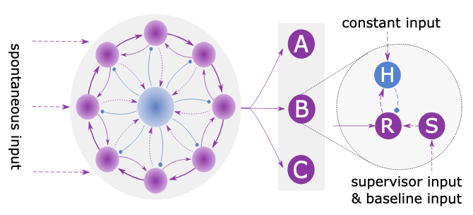

# MBC Network

PyNEST implementation of the spatio-temporal sequence learning model proposed by [Maes et al. 2020](https://journals.plos.org/ploscompbiol/article?id=10.1371/journal.pcbi.1007606).
`MBC` therefore stands for the three authors of the original study: Meas, Barahona and Clopath.

[Maes et al. 2020](https://journals.plos.org/ploscompbiol/article?id=10.1371/journal.pcbi.1007606) proposed a biologically plausible model based on a spiking recurrent neural network supplemented with read-out neurons.
After learning, the recurrent network develops precise switching dynamics by successively activating and deactivating small groups of neurons.
The read-out neurons are trained to respond to particular groups and can thereby reproduce the learned sequence.

We identified some discrepancies between the paper and the code and repaired numerical errors which we describe in [Oberländer et al. 2022](). Our MBC replication serves as an accessible and maintainable implementation of the model which is more consistent with its description in text and tables and contains fewer errors. The model is therefore on a substantially better footing to serve as a basis for future extensions to address new problems or account for more diverse experimental data.

&nbsp;



&nbsp;

The `mbc_replication` repository contains:

1. [experiments](experiments) directory:

    All experiments including training the recurrent network to developp sequential dynamics and the actual sequence learning process. How to run these experiments can be
    found [here](experiments/README.md).

1. [mbc_network](mbc_network) directory:

    Is a small python library which has to be installed before the training scripts in [experiments](experiments) can be executed.

1. [nestml_models](nestml_models) directory:

    MBC model consists of two different neuron types, where only one of them is provided by NEST. The second neuron model is generated by NESTML and installed into NEST. Source file and installation script can be found in this directory.

1. [tests](tests) directory:

    TBA

1. [environment.yaml](environment.yaml) file:

    Used to create a conda environment including all third-party libraries.

1. [setup.py](setup.py) file:

    Used to install the `mbc_network` library.

# Software dependencies

1. Clone [mbc_replication repository](https://github.com/margo1999/mbc_replication) (this repository)
   * checkout the branch `full_network_size`
1. Install [miniconda](https://docs.conda.io/en/latest/miniconda.html)
1. Install python and all necessary python modules using conda and [environment.yaml](../../environment.yaml)
   ```bash
   cd <mbc_replication>
   conda env create -f environment.yaml
   conda activate mbc_replication
   ```
1. Install [mbc_network](../../mbc_network/)
   ```bash
   cd <mbc_replication>
   python setup.py install
   ```
1. Clone [NEST fork](https://github.com/margo1999/nest-simulator) (soon to be equivalent to NEST)
   * checkout the branch `aeif_con_diff_exp_clopath` 
   * build
   * install
1. [Install NESTML](https://nestml.readthedocs.io/en/latest/installation.html)
1. Compile and install NESTML model `iaf_cond_diff_exp` by running 
   ```bash
   cd <mbc_replication>
   python ./nestml_models/compile_and_install_nestml_model.py
   ```

# Run experiments 
Click [here](experiments/README.md) for more details.

## References

1. [Maes A, Barahona M, Clopath C. Learning spatiotemporal signals using a recurrent spiking network that discretizes time. PLoS computational biology. 2020 Jan 21;16(1):e1007606.](https://journals.plos.org/ploscompbiol/article?id=10.1371/journal.pcbi.1007606)
